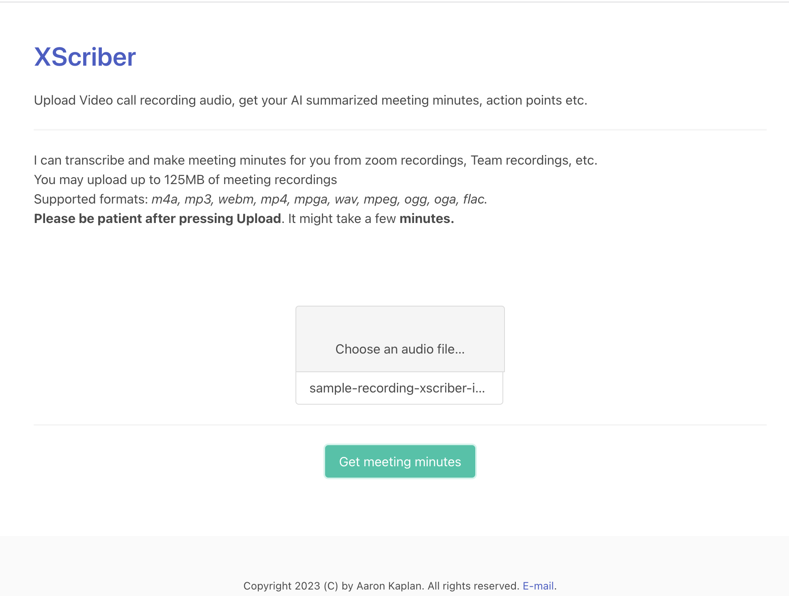

# XScriber

Uses [whisper](https://github.com/openai/whisper) and openAI's [gpt-3.5-turbo-16k](https://platform.openai.com/docs/models/gpt-3-5) Model to summarize recordings of zoom calls, teams calls or any other online meeting 
where you can record the meeting as audio.

## Demo

**[DEMO](examples/README.md) here**


## User interface




# FAQ

## How does it work?

You may upload a recording (m4a, wav, mp3, etc.) (**Note well: Audio only!**) via the web interface.
Then you need to wait (can take up to a few minutes).

Finally, you will be presented a structured text (JSON) of:
  * a summary of the meeting
  * the key points of the meeting
  * any potential action points of the meeting
  * the general sentiment of the meeting.

Of course, it's also possible to convert the resulting text into other formats (.docx MS Word file or similar).
If you have some wishes how the tool should work, please create an [issue](https://github.com/aaronkaplan/xscriber/issues) and mark it as a feature request.

## Can I run the transcription and the summarization locally?

Yes, you could. This is on my personal wishlist.

## Why is it so slow?

The audio files need to be first split up at the right spot so that no context of the meeting is lost.
Then it needs to be sent to whisper for transcription, each part that is.
Then the transcript is sent to OpenAI.

We hope to speed up processing eventually, right now we are limited by the speed of OpenAI.

## How can I help?

I need help with:

- coding: the code quality should be considered quick & dirty
- way slicker user interface and UX. 
- Proper error message formatting and display
- more / better unit tests
- proper MLOps pipeline support
- sample recordings and output text for end-to-end tests
- a better API which supports a HTTP GET parameter `?outputformat={docx,pdf,...}`
- interfacing local whisper installations
- interfacing local LLMs ([StableBeluga-2](https://huggingface.co/stabilityai/StableBeluga2) seems currently like a good option)


A detailed description on how to contribute is [here](CONTRIBUTING.md).

Remember, this is a proof of concept right now. 


# Developer notes

If you want to run this service yourself, you can either do so via docker:

```bash
make
# which basically does a docker compose  --env-file .env up -d
```

or via command line directly (without docker):

```bash
virtualenv --python=python3.11 venv
source venv/bin/activate
# copy & modify .env: cp env.dist .env
source .env
uvicorn app.main:app --host 0.0.0.0 --port 9977 --reload
```

